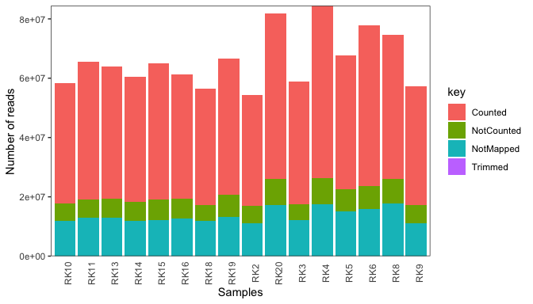
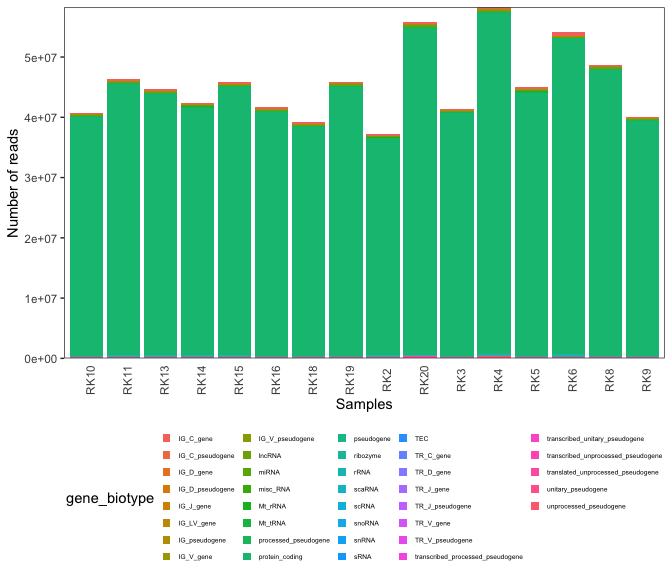
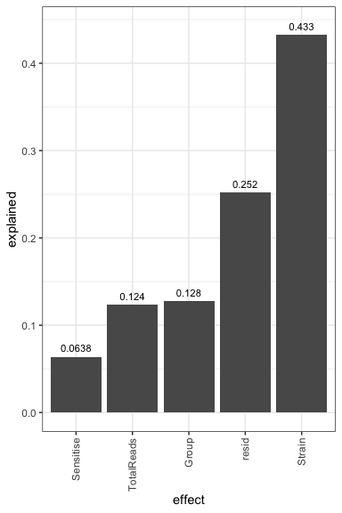
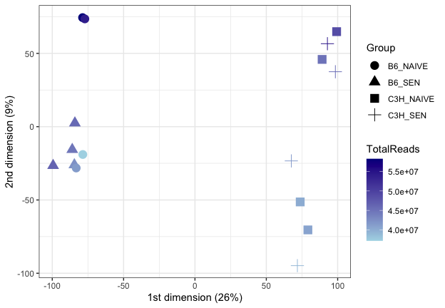
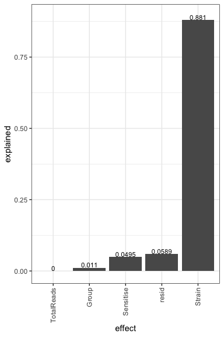
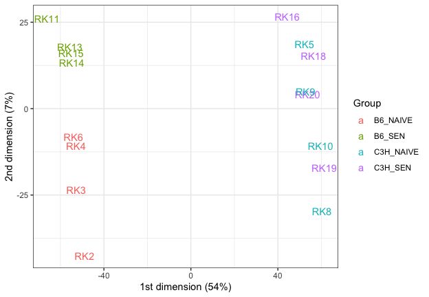
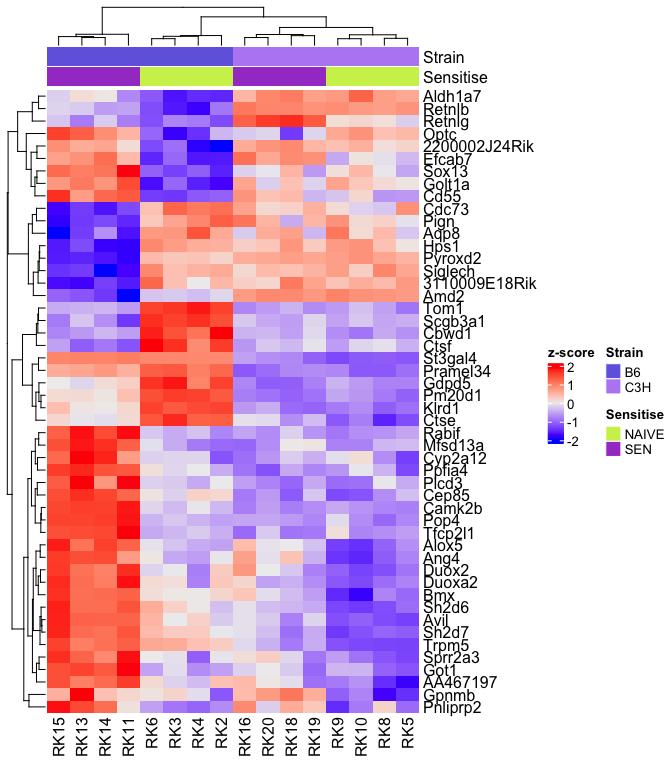
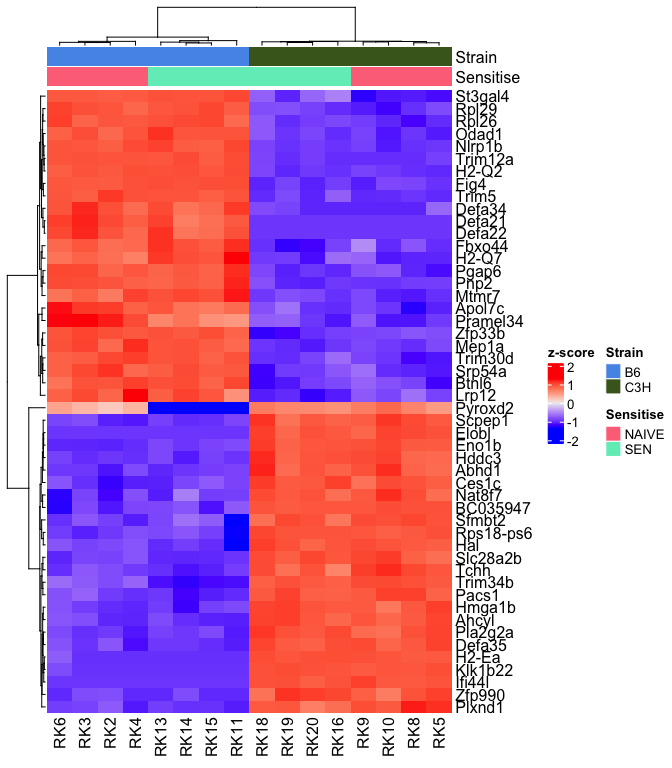

Williams Anaphylaxis Bulk RNA-Seq
================
Slim Fourati
2024-11-15

# Design: 150pb PE strand-specific

Load package

``` r
suppressPackageStartupMessages(library(package = "knitr"))
suppressPackageStartupMessages(library(package = "readxl"))
suppressPackageStartupMessages(library(package = "EDASeq"))
suppressPackageStartupMessages(library(package = "biomaRt"))
suppressPackageStartupMessages(library(package = "ggbeeswarm"))
suppressPackageStartupMessages(library(package = "pvca")) # dleelab/pvca
suppressPackageStartupMessages(library(package = "lme4"))
suppressPackageStartupMessages(library(package = "edgeR"))
suppressPackageStartupMessages(library(package = "ComplexHeatmap"))
suppressPackageStartupMessages(library(package = "tidyverse"))
```

Set session options

``` r
workDir <- dirname(getwd())
opts_chunk$set(tidy = FALSE, fig.path = "../figure/")
```

Read raw counts

``` r
countDF <- read_tsv(file           = file.path(workDir, "input/williams.genecounts.tsv"),
                    show_col_types = FALSE) %>%
  column_to_rownames(var = "gene_id") %>%
  `colnames<-`(gsub(pattern = "_S[0-9]*_genecounts", replacement = "", names(.))) %>%
  as.data.frame()
```

Create sample annotation

``` r
sampleAnnotFile <- file.path(workDir, "input/Williams01_02.15.2024.xlsx")
sampleAnnotDF <- read_excel(path  = sampleAnnotFile, 
                      col_names = FALSE) %>%
  setNames(nm = c("SampleID", "Group"))
sampleAnnotDF <- sampleAnnotDF[match(colnames(countDF), table = sampleAnnotDF$SampleID), ]
# correct sample swap
sampleAnnotDF <- sampleAnnotDF %>%
  mutate(Group = ifelse(test = SampleID %in% "RK5",
                                       yes  = "C3H_NAIVE_1",
                                       no   = Group),
         Group = ifelse(test = SampleID %in% "RK6",
                                       yes  = "B6_NAIVE_5",
                                       no   = Group))
# add total reads counted
sampleAnnotDF$TotalReads <- colSums(countDF)
sampleAnnotDF <- sampleAnnotDF %>%
  as.data.frame() %>%
  `rownames<-`(.$SampleID)
```

Read feature annotation

``` r
colNames <- c("seqname",
              "source",
              "feature",
              "start",
              "end",
              "score",
              "strand",
              "frame",
              "attribute")
colTypes <- paste(c(rep("c", times = 3),
                    rep("i", times = 2),
                    rep("c", times = 4)),
                  collapse = "")
documentsDir <- file.path(workDir, "input")
featuresAnnotationFile <- "Mus_musculus.GRCm39.110.gtf"
skipNb <- read_lines(file = file.path(documentsDir, featuresAnnotationFile))
skipNb <- sum(grepl(pattern = "^#", skipNb))
featuresAnnot <- read_tsv(file      = file.path(documentsDir,
                                                featuresAnnotationFile),
                          skip      = skipNb,
                          col_names = colNames,
                          col_types = colTypes)
# extract gene_id and transcript_id from attributes
featAnnot <- featuresAnnot %>%
  mutate(gene_id = gsub(pattern = ".*gene_id \"([^;]+)\";.+",
                        replacement = "\\1",
                        attribute),
         gene_name = ifelse(test = grepl(pattern = "gene_name",
                                         attribute),
                            yes = gsub(pattern = ".+gene_name \"([^;]+)\";.+",
                                       replacement = "\\1",
                                       attribute),
                            no  = NA),
         gene_biotype = ifelse(test = grepl(pattern = "gene_biotype",
                                         attribute),
                            yes = gsub(pattern = ".+gene_biotype \"([^;]+)\";.*",
                                       replacement = "\\1",
                                       attribute),
                            no  = NA)) %>%
  select(seqname, strand, gene_id, gene_name, gene_biotype) %>%
  distinct() %>%
  as.data.frame()
rownames(featAnnot) <- featAnnot$gene_id
featAnnot <- featAnnot[rownames(countDF), ]
```

Create raw SeqExpressionSet

``` r
# build  raw ExpressionSet
esetRaw <- newSeqExpressionSet(counts      = as.matrix(countDF),
                               featureData = AnnotatedDataFrame(featAnnot),
                               phenoData   = AnnotatedDataFrame(sampleAnnotDF))
save(esetRaw, file = file.path(workDir, "output/williams.esetRaw.RData"))
print(esetRaw)
```

    ## SeqExpressionSet (storageMode: lockedEnvironment)
    ## assayData: 56941 features, 16 samples 
    ##   element names: counts, normalizedCounts, offset 
    ## protocolData: none
    ## phenoData
    ##   sampleNames: RK10 RK11 ... RK9 (16 total)
    ##   varLabels: SampleID Group TotalReads
    ##   varMetadata: labelDescription
    ## featureData
    ##   featureNames: ENSMUSG00000000001 ENSMUSG00000000003 ...
    ##     ENSMUSG00002076992 (56941 total)
    ##   fvarLabels: seqname strand ... gene_biotype (5 total)
    ##   fvarMetadata: labelDescription
    ## experimentData: use 'experimentData(object)'
    ## Annotation:

# Plot alignment metrics

``` r
statDF <- read_tsv(file           = file.path(workDir, "input/ReadStats.txt"),
                   col_names      = FALSE,
                   show_col_types = FALSE) %>%
  mutate(X1 = gsub(pattern = "_S[0-9].?$", replacement = "", X1)) %>%
  distinct() %>%
  pivot_wider(names_from = "X3", values_from = "X2")
plotDF <- counts(esetRaw) %>% 
  colSums() %>%
  data.frame(Counted = .) %>%
  rownames_to_column() %>%
  merge(x = statDF, by.x = "X1", by.y = "rowname")
plotDF <- plotDF %>%
  mutate(Trimmed    = TotalReads - Surviving,
         NotMapped  = Surviving - UniqMapped - Multimapped,
         NotCounted = UniqMapped + Multimapped - Counted) %>%
  select(Trimmed, NotMapped, NotCounted, Counted, X1) %>%
  pivot_longer(cols = -X1, names_to = "key")
ggplot(data = plotDF,
                   mapping = aes(x = X1, y = value, fill = key)) +
  geom_bar(stat = "identity") +
  scale_y_continuous(expand = c(0, 0)) +
  labs(x = "Samples", y = "Number of reads") +
  theme_bw() +
  theme(axis.text.x      = element_text(angle = 90, hjust = 0.5),
        axis.ticks.x     = element_blank(),
        panel.grid.major = element_blank(),
        panel.grid.minor = element_blank())
```


All samples have more than 30e6 millions counted, enough for DEG
analysis  
<br/><br/> Plot type of coding genes measured

``` r
plotDF <- counts(esetRaw) %>%
  as.data.frame() %>%
  rownames_to_column(var = "gene_id") %>%
  merge(y  = select(fData(esetRaw), gene_id, gene_biotype),
        by = "gene_id") %>%
  pivot_longer(cols = -c(gene_id, gene_biotype), names_to = "sample") %>%
  group_by(sample, gene_biotype) %>%
  summarize(eta = sum(value),
            mu  = mean(value),
            q2  = median(value),
            .groups = "drop")
 
ggplot(data = plotDF,
                   mapping = aes(x = sample, y = eta, fill = gene_biotype)) +
  geom_bar(stat = "identity") +
  scale_y_continuous(expand = c(0, 0)) +
  labs(x = "Samples", y = "Number of reads") +
  theme_bw() +
  theme(axis.text.x      = element_text(angle = 90, hjust = 0.5),
        axis.ticks.x     = element_blank(),
        panel.grid.major = element_blank(),
        panel.grid.minor = element_blank(),
        legend.position  = "bottom",
        legend.text      = element_text(size = unit(5, units = "in")),
        legend.key.size  = unit(0.1, units = "in"))
```


Most reads map to protein coding genes.

# PVCA on raw counts

``` r
mat <- counts(esetRaw)
mat <- mat[rowSums(mat) > 0, ]
mat <- log2(mat + 0.25)
pdata <- pData(esetRaw) %>%
  mutate(TotalReads = findInterval(TotalReads,
                                   vec = quantile(TotalReads, probs = c(0, 0.25, 0.5, 0.75, 1)),
                                   all.inside = TRUE),
         Strain     = gsub(pattern = "_.+", replacement = "", Group),
         Sensitise  = gsub(pattern = ".+_", replacement = "", Group)) %>%
  setNames(nm = make.names(names(.))) %>%
  select(-SampleID) %>%
  mutate(Group = gsub(pattern = "_[0-9]$", replacement = "", Group)) %>%
  mutate_all(as.factor)
fit <- PVCA(counts = mat,
            meta = pdata,
            threshold = 0.6,
            inter = FALSE)
plotDF <- data.frame(explained = as.vector(fit),
                     effect    = names(fit)) %>%
  arrange(explained) %>%
  mutate(effect = factor(effect, levels = effect))
ggplot(data = plotDF,
       mapping = aes(x = effect, y = explained)) +
  geom_bar(stat = "identity") +
  geom_text(aes(label = signif(explained, digits = 3)),
            nudge_y = 0.01,
            size = 3) +
  theme_bw() +
  theme(axis.text.x = element_text(angle = 90,
                                   vjust = 0.5,
                                   hjust = 1))
```


Strong group effect.

# MDS plot on raw counts

``` r
rawMat <- counts(esetRaw)
mat <- rawMat[rowSums(rawMat) > 0, ]
mat <- log2(mat + 0.25)
distMat <- dist(t(mat))
fit <- cmdscale(distMat, k = 2, eig = TRUE)
plotDF <- as.data.frame(fit$points)
plotDF <- plotDF %>%
  rownames_to_column(var = "SampleID") %>%
  merge(x = pData(esetRaw),
        by = "SampleID") %>%
  mutate(Group = gsub(pattern = "_[0-9]$", replacement = "", Group))
ggplot(data    = plotDF,
                   mapping = aes(x     = V1,
                                 y     = V2,
                                 label = `SampleID`,
                                 color = TotalReads,
                                 shape = Group)) +
  geom_point(size = 4) +
  labs(x = paste0("1st dimension (",
                        round((fit$eig/sum(fit$eig))[1] * 100),
                        "%)"),
                    y = paste0("2nd dimension (",
                        round((fit$eig/sum(fit$eig))[2] * 100),
                        "%)")) +
  scale_color_continuous(low = "lightblue", high = "darkblue") +
  theme_bw()
```



TMM normalization of count data

``` r
dge <- DGEList(counts       = counts(esetRaw),
               remove.zeros = TRUE)
# remove low expressed genes
flag <- filterByExpr(dge, group = esetRaw$Group)
dge <- dge[flag, , keep.lib.sizes = FALSE]
dge <- calcNormFactors(object = dge, method = "TMM")
normalizedCounts <- cpm(dge, normalized.lib.sizes = TRUE, log = TRUE)
eset <-  newSeqExpressionSet(
    counts           = dge$counts,
    normalizedCounts = as.matrix(normalizedCounts),
    featureData      = fData(esetRaw)[rownames(normalizedCounts), ],
    phenoData        = pData(esetRaw))
save(eset, file = file.path(workDir, "output/williams.eset.RData"))
```

``` r
load(file = file.path(workDir, "output/williams.eset.RData"))
```

# PVCA on normalized counts

``` r
mat <- normCounts(eset)
pdata <- pData(eset) %>%
  mutate(TotalReads = findInterval(TotalReads,
                                   vec = quantile(TotalReads, probs = c(0, 0.25, 0.5, 0.75, 1)),
                                   all.inside = TRUE)) %>%
  select(-SampleID) %>%
  mutate(Group = gsub(pattern = "_[0-9]$", replacement = "", Group),
         Strain     = gsub(pattern = "_.+", replacement = "", Group),
         Sensitise  = gsub(pattern = ".+_", replacement = "", Group)) %>%
  setNames(nm = make.names(names(.))) %>%
  mutate_all(as.factor)
fit <- PVCA(counts = mat,
            meta = pdata,
            threshold = 0.6,
            inter = FALSE)
plotDF <- data.frame(explained = as.vector(fit),
                     effect    = names(fit)) %>%
  arrange(explained) %>%
  mutate(effect = factor(effect, levels = effect))
ggplot(data = plotDF,
       mapping = aes(x = effect, y = explained)) +
  geom_bar(stat = "identity") +
  geom_text(aes(label = signif(explained, digits = 3)),
            nudge_y = 0.01,
            size = 3) +
  theme_bw() +
  theme(axis.text.x = element_text(angle = 90,
                                   vjust = 0.5,
                                   hjust = 1))
```



# MDS plot on TMM normalized counts

``` r
mat <- normCounts(eset)
distMat <- dist(t(mat))
fit <- cmdscale(distMat, k = 2, eig = TRUE)
plotDF <- as.data.frame(fit$points) %>%
  rownames_to_column(var = "SampleID") %>%
  merge(x = pData(eset),
        by = "SampleID") %>%
  mutate(Group = gsub(pattern = "_[0-9]$", replacement = "", Group))
plotLabel <- round((fit$eig/sum(fit$eig)) * 100)
plotLabel <- plotLabel[1:2]
plotLabel <- paste0(c("1st dimension (", "2nd dimension ("),
                    plotLabel,
                    "%)")
ggplot(data = plotDF,
                   mapping = aes(x = V1,
                                 y = V2,
                                 color = Group)) +
  geom_text(mapping = aes(label = `SampleID`)) +
  labs(x = plotLabel[[1]],
       y = plotLabel[[2]]) +
  theme_bw() +
  theme(legend.key = element_blank())
```



# Differential expression using edgeR

``` r
fits <- list()
# sensitization
Group <- gsub(pattern = "_[0-9]$", replacement = "", eset$Group) %>%
  factor()
designMat <- model.matrix(~0+Group)
rownames(designMat) <- sampleNames(eset)
colnames(designMat) <- gsub(pattern = "Group", replacement = "", colnames(designMat))
dgeTemp <- DGEList(counts       = counts(eset),
                                  remove.zeros = TRUE)
dgeTemp <- calcNormFactors(object = dgeTemp, method = "TMM")
dgeTemp <- estimateGLMCommonDisp(y = dgeTemp, design = designMat)
dgeTemp <- estimateGLMTrendedDisp(y = dgeTemp, design = designMat)
dgeTemp <- estimateGLMTagwiseDisp(y = dgeTemp, design = designMat)
fit <- glmFit(y = dgeTemp, design = designMat)
fit$genes <- fData(eset)[rownames(fit$coef), ]
contrastLS <- c("B6_SEN-B6_NAIVE", "C3H_SEN-C3H_NAIVE")
contrast <-  makeContrasts(contrasts = contrastLS, levels = fit$design)
fit$contrast <- contrast
fits[["sensitization"]] <- list(fit = fit)

contrastLS <- c("C3H_SEN-B6_SEN", "C3H_NAIVE-B6_NAIVE")
contrast <-  makeContrasts(contrasts = contrastLS, levels = fit$design)
fit$contrast <- contrast
fits[["strain"]] <- list(fit = fit)

save(fits, file = file.path(workDir, "output/williams.fits.RData"))
```

``` r
load(file = file.path(workDir, "output/williams.fits.RData"))
```

# Number of DEG

``` r
degDF <- NULL
for (modelName in names(fits)) {
  fit <- fits[[modelName]][["fit"]]
  for (coefName in colnames(fit$contrast)) {
    fit2 <- glmLRT(glmfit = fit, contrast = fit$contrast[, coefName])
    topTags(fit2, n = Inf) %>%
      as.data.frame() %>%
      filter(logCPM > 0 & 
             gene_biotype %in% "protein_coding" & 
             FDR <= 0.05 &
             !is.na(gene_name)) %>%
    mutate(modelName = modelName,
           coefficient = coefName) %>%
    group_by(sign(logFC), modelName, coefName) %>%
    summarize(n = n(), .groups = "drop") %>%
  mutate(`sign(logFC)` = recode(`sign(logFC)`, "-1" = "Neg", "1" = "Pos")) %>%
    rbind(degDF, .) -> degDF
  }
}
degDF %>%
  kable()
```

| sign(logFC) | modelName     | coefName           |    n |
|:------------|:--------------|:-------------------|-----:|
| Neg         | sensitization | B6_SEN-B6_NAIVE    |  137 |
| Pos         | sensitization | B6_SEN-B6_NAIVE    |  102 |
| Neg         | sensitization | C3H_SEN-C3H_NAIVE  |    5 |
| Pos         | sensitization | C3H_SEN-C3H_NAIVE  |   21 |
| Neg         | strain        | C3H_SEN-B6_SEN     | 1544 |
| Pos         | strain        | C3H_SEN-B6_SEN     | 1434 |
| Neg         | strain        | C3H_NAIVE-B6_NAIVE | 1311 |
| Pos         | strain        | C3H_NAIVE-B6_NAIVE | 1184 |

# Heatmap top 50 DEGs Sensitization

``` r
modelName <- "sensitization"
fit <- fits[[modelName]][["fit"]]
fit2 <- glmLRT(glmfit = fit, contrast = fit$contrast)
top50 <- topTags(fit2, n = Inf) %>%
  as.data.frame() %>%
  filter(logCPM > 0 & 
         gene_biotype %in% "protein_coding" & 
         FDR <= 0.05 &
         !is.na(gene_name)) %>%
  mutate(modelName = modelName) %>%
  top_n(n = 50, wt = -PValue)

mat <- normCounts(eset)[top50$gene_id, ]
mat <- t(scale(t(mat)))
ha <- HeatmapAnnotation(Strain    = gsub(pattern = "_.+", replacement = "", eset$Group),
                        Sensitise = gsub(pattern = "^[^_]+_|_[0-9]$", replacement = "", eset$Group))
Heatmap(matrix         = mat,
        name           = "z-score",
        row_labels     = top50$gene_name,
        top_annotation = ha)
```


Process: Protein Degradation

Protein Ubiquitination: Several proteins in the list, such as Ctse,
Ctsf, and Rabif, are associated with lysosomal degradation pathways.
These proteins are involved in tagging unwanted or damaged proteins with
ubiquitin for degradation.  
Protease Activity: Proteins like Ctse and Ctsf are cysteine proteases
implicated in protein degradation within lysosomes. Their presence
suggests involvement in breaking down proteins into smaller peptides.  
Endocytosis Regulation: Proteins like Cd55 and Siglech are involved in
endocytosis regulation. They play roles in modulating the
internalization of proteins, which could contribute to their subsequent
degradation.  
Autophagy Regulation: Proteins such as Rabif and Optc are associated
with autophagy, the process of cellular self-degradation. They likely
participate in the regulation of autophagic flux, influencing the
degradation of cellular components.  
Protein Turnover: Many proteins listed are implicated in various aspects
of protein degradation pathways, indicating a concerted effort towards
maintaining protein homeostasis within the cell.

# Heatmap top 50 DEGs Strain

``` r
modelName <- "strain"
fit <- fits[[modelName]][["fit"]]
fit2 <- glmLRT(glmfit = fit, contrast = fit$contrast)
top50 <- topTags(fit2, n = Inf) %>%
  as.data.frame() %>%
  filter(logCPM > 0 & 
         gene_biotype %in% "protein_coding" & 
         FDR <= 0.05 &
         !is.na(gene_name)) %>%
  mutate(modelName = modelName) %>%
  top_n(n = 50, wt = -PValue)

mat <- normCounts(eset)[top50$gene_id, ]
mat <- t(scale(t(mat)))
ha <- HeatmapAnnotation(Strain    = gsub(pattern = "_.+", replacement = "", eset$Group),
                        Sensitise = gsub(pattern = "^[^_]+_|_[0-9]$", replacement = "", eset$Group))
Heatmap(matrix         = mat,
        name           = "z-score",
        row_labels     = top50$gene_name,
        top_annotation = ha)
```


Process: Immune Response Regulation

Antigen Presentation: Proteins H2-Ea, H2-Q2, and Trim12a are involved in
presenting antigens to T cells, crucial for immune surveillance and
activation. Inflammatory Response: Proteins such as Defa35, Nlrp1b, and
Pla2g2a participate in initiating and regulating inflammatory responses,
contributing to defense against pathogens.  
Protease Activity: Enzymes like Klk1b22 and Proteins like Trim5,
Trim30d, and Trim34b exhibit protease activity, which is essential for
processing antigens, regulating signaling pathways, and controlling
protein turnover.  
Cellular Signaling: Proteins such as Zfp33b, Pacs1, and St3gal4 are
involved in various signaling pathways, including those regulating
immune responses, cell proliferation, and differentiation.  
Host Defense: Defensins (e.g., Defa21, Defa22, Defa34) play a crucial
role in host defense by exerting antimicrobial activity against
pathogens. Regulation of RNA Processing: Proteins like Rps18-ps6 and
Rpl26 are involved in ribosome assembly and RNA processing, crucial for
protein synthesis and cellular function.  
Metabolic Regulation: Enzymes such as Eno1b and Mep1a participate in
metabolic pathways, providing energy and building blocks necessary for
immune cell function.  
Stress Response: Proteins like Hmga1b and Ahcyl are involved in cellular
stress responses, which are crucial for maintaining cellular homeostasis
during immune challenges.
